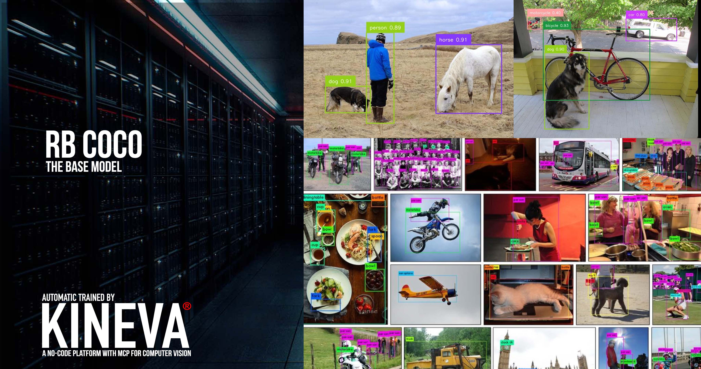
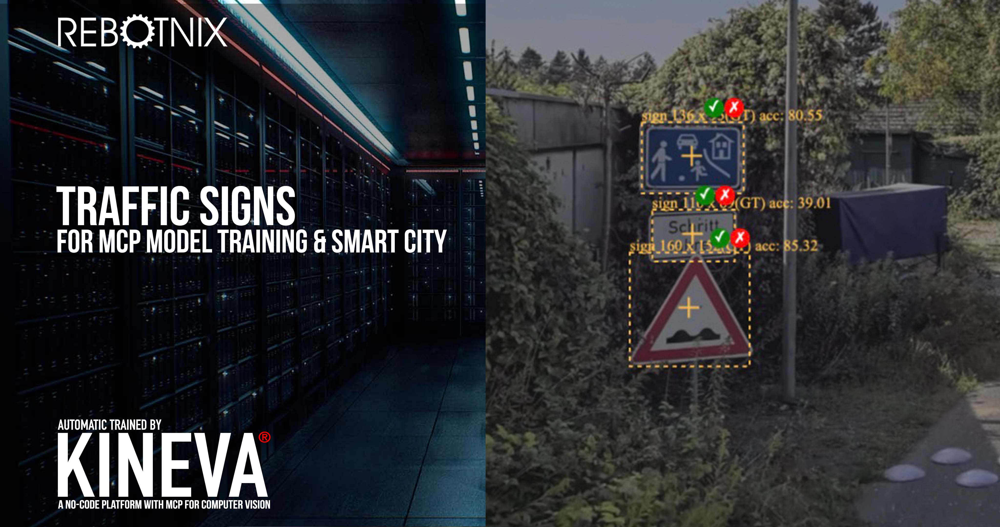
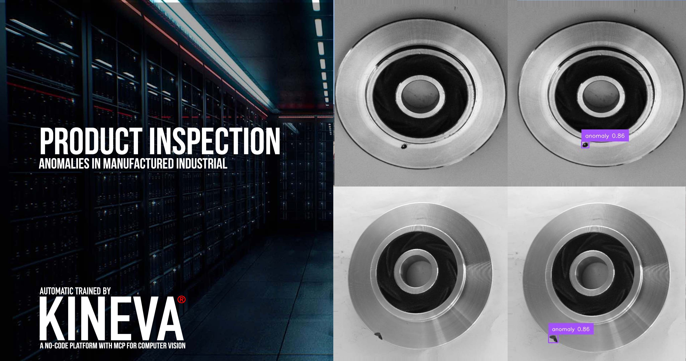
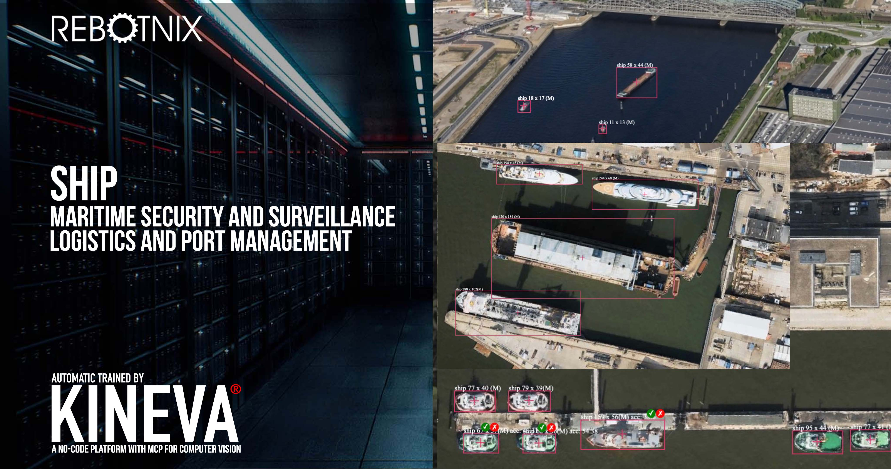

# KINEVA Inference

**KINEVA Inference** is a high-performance, GPU-accelerated solution designed for deploying deep learning models on **NVIDIA Jetson** devices. Built for speed and efficiency, KINEVA enables lightning-fast inference at the edge, with seamless integration into real-time systems.

Whether you're running object detection, or anomaly detection, KINEVA provides everything needed to convert, optimize, and deploy models for ultra-fast execution on Jetson hardware.

---

## 🚀 Features

- Optimized for real-time inference on NVIDIA Jetson devices
- Modular design supporting multiple model architectures
- Built-in conversion tools for high-speed TensorRT deployment

---

## 🧠 Prebuilt Models

KINEVA offers a curated suite of **8 high-performance, production-ready AI models**, purpose-built for edge applications. These models are available under a **commercial licensing model**, giving you the flexibility to integrate best-in-class AI into your product without the burden of training from scratch.

From **object detection** and **defect inspection** to **traffic sign recognition** and **license plate localization**, each model is fully optimized for real-time inference on **NVIDIA Jetson** hardware.

KINEVA uses two different network architectures: AF and KD. The only difference between AF and KD is the backbone. The difference between the silver and gold versions lies in the number of parameters the model was trained with, as well as differences in the model architecture and input height. For testing we also trained some models with detectron, just for comparision. 

KINEVA GOLD AF has 80 million parameters.  
KINEVA SILVER AF has 9.52 Million parameters.


## KINEVA Models

| Model Name                                                                 | Model Type        | Detection Type    | Description                                                                                       | Example Output                                |
|----------------------------------------------------------------------------|-------------------|-------------------|---------------------------------------------------------------------------------------------------|-----------------------------------------------|
| [rb_coco](https://huggingface.co/rebotnix/rb_coco)                         | KINEVA GOLD AF    | Object Detection  | Object detection based on COCO classes (people, vehicles, etc.)                                   | [](https://huggingface.co/rebotnix/rb_coco) |
| [rb_coco](https://huggingface.co/rebotnix/rb_coco)                         | KINEVA SILVER AF  | Object Detection  | Object detection based on COCO classes (people, vehicles, etc.)                                   | [](https://huggingface.co/rebotnix/rb_coco) |

## RF-DETR Models

| Model Name                                                                 | Model Type        | Detection Type    | Description                                                                                       | Example Output                                |
|----------------------------------------------------------------------------|-------------------|-------------------|---------------------------------------------------------------------------------------------------|-----------------------------------------------|
| [rb_trafficsign](https://huggingface.co/rebotnix/rb_trafficsign)          | RF-DETR           | Object Detection  | Detection and classification of traffic signs                                                     | [](https://huggingface.co/rebotnix/rb_trafficsign)  |
| [rb_productInspection](https://huggingface.co/rebotnix/rb_productInspection) | RF-DETR         | Object Detection  | Visual quality control and anomaly detection in product assembly lines                            | [](https://huggingface.co/rebotnix/rb_productInspection) |
| [rb_licenseplate](https://huggingface.co/rebotnix/rb_licenseplate)        | RF-DETR           | Object Detection  | License plate detection and OCR-ready localization                                                | [](https://huggingface.co/rebotnix/rb_licenseplate) |
| [rb_graffiti](https://huggingface.co/rebotnix/rb_graffiti)                | RF-DETR           | Object Detection  | Detection of graffiti and visual vandalism in urban environments                                  | [](https://huggingface.co/rebotnix/rb_graffiti)        |
| [rb_aircraft](https://huggingface.co/rebotnix/rb_aircraft)                | RF-DETR           | Object Detection  | Aircraft detection and classification for aviation or surveillance use cases on aerial images     | [](https://huggingface.co/rebotnix/rb_aircraft)        |
| [rb_vehicle](https://huggingface.co/rebotnix/rb_vehicle)                  | RF-DETR           | Object Detection  | Specialized vehicle detection in traffic or parking scenarios on aerial images                    | [](https://huggingface.co/rebotnix/rb_vehicle)          |
| [rb_ship](https://huggingface.co/rebotnix/rb_ship)                        | RF-DETR           | Object Detection  | Ship and vessel detection in ports, harbors, or maritime surveillance on aerial images            | [](https://huggingface.co/rebotnix/rb_ship)                |              |


💡 Need a custom model? Contact us to train, optimize, and deploy your AI models through the KINEVA pipeline.

🔗 Download Pretrained KINEVA Models
Pretrained KINEVA models, optimized for NVIDIA Jetson, are available via our official Hugging Face repository:

👉 [https://huggingface.co/rebotnix](https://huggingface.co/rebotnix)

---

## 📥 Installation

Install first neccessary packages if not installed yet:

```bash
sudo apt install libopenblas-base libopenblas-dev cmake curl
```

On Jetpack 5.1 and 5.2 we reccomend **CMake 3.22.**

Clone the repository:

```bash
#download repository
git clone https://github.com/rebotnix/kineva_inference.git
cd kineva_inference

#create virtual env
virtualenv -p python3 venv

#load venv
source venv/bin/activate
```

Install steps for **Jetpack 5.1 or 5.2**:

```bash
#install torch
wget https://docs.rebotnix.com/downloads/wheels/torch-2.2.0-cp38-cp38-linux_aarch64.whl --no-check-certificate
pip install torch-2.2.0-cp38-cp38-linux_aarch64.whl

#install torchvision
wget https://docs.rebotnix.com/downloads/wheels/torchvision-0.17.2+c1d70fe-cp38-cp38-linux_aarch64.whl --no-check-certificate
pip install torchvision-0.17.2+c1d70fe-cp38-cp38-linux_aarch64.whl

# install tensorrt
mkdir -p venv/lib/python3.8/site-packages/tensorrt
wget -P venv/lib/python3.8/site-packages/tensorrt https://docs.rebotnix.com/downloads/wheels/tensorrt_38/__init__.py --no-check-certificate
wget -P venv/lib/python3.8/site-packages/tensorrt https://docs.rebotnix.com/downloads/wheels/tensorrt_38/tensorrt.so --no-check-certificate
```

Install steps for **Jetpack 6.1**:

```bash
#install torch
wget https://docs.rebotnix.com/downloads/wheels/torch-2.7.0-cp310-cp310-linux_aarch64.whl --no-check-certificate
pip install torch-2.7.0-cp310-cp310-linux_aarch64.whl

#install torchvision
wget https://docs.rebotnix.com/downloads/wheels/torchvision-0.22.0-cp310-cp310-linux_aarch64.whl --no-check-certificate
pip install torchvision-0.22.0-cp310-cp310-linux_aarch64.whl

# install tensorrt
mkdir -p venv/lib/python3.10/site-packages/tensorrt
wget -P venv/lib/python3.10/site-packages/tensorrt https://docs.rebotnix.com/downloads/wheels/tensorrt_310/__init__.py --no-check-certificate
wget -P venv/lib/python3.10/site-packages/tensorrt https://docs.rebotnix.com/downloads/wheels/tensorrt_310/tensorrt.so --no-check-certificate
```

Now install requirements:

```bash
pip install --no-build-isolation -r requirements.txt
```

To run the SDK the following prerequisites need to be installed **with GPU support**:

- [PyTorch](https://github.com/pytorch/pytorch) (compatible with your CUDA version)
- [torchvision](https://github.com/pytorch/vision)
- [TensorRT](https://github.com/NVIDIA/TensorRT)

> ✅ **Important:**  
> The `trtexec` tool from TensorRT must be installed and accessible in your terminal (i.e., it should be in your system's `PATH`).
>
> You can verify with:
> ```bash
> trtexec --help
> ```
> If not found, you may need to add it:
> ```bash
> export PATH=$PATH:/usr/src/tensorrt/bin  # adjust path if needed
> ```

---


## ⚙️ Integration
Once downloaded, KINEVA models can be:

Converted to TensorRT using KINEVA's model conversion tools

Deployed for ultra-fast inference on Jetson devices

Used with built-in postprocessing for bounding boxes and class predictions

The model works seamlessly with KINEVA’s modular interface—just specify the model path and config, and you're ready to run inference.

---

## Examples

### Download a KINEVA model for export
Exchange the placeholder YOUR_HF_TOKEN with your own huggingface token.

```bash
mkdir models
cd models
curl -L -o rb_coco.pth -H "Authorization: Bearer YOUR_HF_TOKEN" "https://huggingface.co/rebotnix/rb_coco/resolve/main/rb_coco.pth?download=true"
cd ..
```

### Export KINEVA model to TRT
Run the export script to create a .trt file.
```bash
PYTHONPATH=$(pwd) python examples/export_kineva.py
```
Edit the file examples/export_kineva.py if you want to change the pth file.


### Run inference with KINEVA TRT

```bash
PYTHONPATH=$(pwd) python examples/test_kineva.py
```
Edit the file examples/test_kineva.py if you want to change the pth/pt file.


## Contact

📫 For commercial use or or other questions please contact us here:

✉️ Email: [communicate@rebotnix.com](mailto:communicate@rebotnix.com)

🌐 Website: [https://rebotnix.com](https://rebotnix.com)
